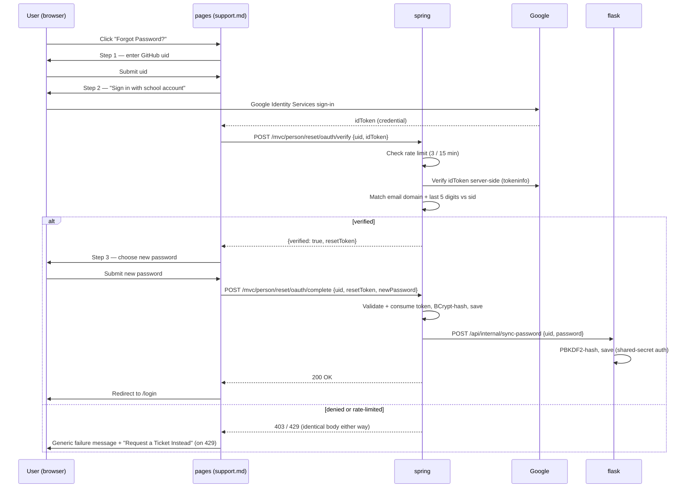

# Forgot Password Pipeline

How password reset works across `pages`, `spring`, and `flask` — the three independently-versioned pieces of the same full-stack app. Current as of 2026-08-20.

> ### ⚠️ REQUIRED BEFORE THIS DEPLOYS TO PRODUCTION
>
> The `token_version` migration (see "Session/token invalidation" below) has only been applied to the **local dev SQLite databases**. Production Flask runs **MySQL** (`__init__.py` — `SQLALCHEMY_DATABASE_URI` switches to MySQL whenever `DB_ENDPOINT`/`DB_USERNAME`/`DB_PASSWORD` are set), which is a completely separate database this session had no access to. **Someone must run this against production before the Flask code ships, or every login there will start throwing errors on the missing column:**
>
> ```sql
> ALTER TABLE users ADD COLUMN token_version INTEGER NOT NULL DEFAULT 0;
> ```
>
> Spring's production schema needs the equivalent, run against whatever database backs that deployment (`RESET_TOKEN_SECRET`-style `.env`/`Dotenv` resolution doesn't apply here — this is a raw DB migration, not an env var):
>
> ```sql
> ALTER TABLE person ADD COLUMN token_version bigint NOT NULL DEFAULT 0;
> ```
>
> The `reset_ticket` table itself (Spring, the "Escape hatch" feature below) is also new and won't exist in production yet either — this one's a full table, not a single column:
>
> ```sql
> CREATE TABLE IF NOT EXISTS "reset_ticket" (
>   "attempts_granted" integer not null,
>   "created_at" varchar(255),
>   "name" varchar(255),
>   "resolved" boolean not null,
>   "resolved_at" varchar(255),
>   "uid" varchar(255) not null,
>   "id" integer,
>   primary key ("id")
> );
> ```
>
> (SQLite syntax shown, matching what's in local dev — adjust types for whatever production actually runs.)

## Summary

There are **three distinct reset paths** live in the system today, plus an escape hatch for when the primary path's rate limit is hit. Only one of them is the advertised, primary path; the other two remain reachable but unlinked from the main UI.

| Path | Verifies identity via | User picks own password? | Status |
|---|---|---|---|
| OAuth + Student ID (primary) | Google Sign-In + student ID digit match | Yes | Live, advertised everywhere |
| Email code (legacy) | Emailed one-time code | No — reset to `DEFAULT_PASSWORD` | Live, reachable only by direct link |
| Admin reset | Admin's own session | No — reset to `DEFAULT_PASSWORD` | Live, admin portal only |
| Reset ticket (escape hatch) | None (admin manually approves) | N/A — grants more attempts, doesn't reset | Live, triggers when rate-limited |

**Before treating any of this as hardened:** see "Known gaps" below. Session/token invalidation on password change (the most significant item) has since been fixed on both backends' JWT paths and on Flask's session path — see "Security mechanisms." Spring's separate MVC session path (`HttpSession`, form login under `/mvc/**`) remains open; that one's scoped out for now, not fixed.

## System roles

- **`pages`** — the only frontend. Owns the reset wizard UI (`navigation/authentication/support.md`) and the two "Forgot Password?" entry points (its own `login.md`, plus Spring's server-rendered `login.html`).
- **`spring`** — the identity authority. Verifies who's requesting a reset, issues signed reset tokens, and is the only system that decides whether a reset is allowed.
- **`flask`** — a downstream mirror, nothing more. It has no reset logic of its own; it exists to keep its own password copy in sync with whatever Spring just verified. This is intentional, not a gap.

## Primary flow: OAuth + Student ID verified reset



### Step by step

1. **Entry points** — `pages/_layouts/profile.html` and `pages/navigation/authentication/login.md` both link to `/support?topic=reset`, which deep-links straight into the wizard. Spring's own `login.html` (served at `/login` on the Spring origin) links to the same wizard cross-origin, resolving the `pages` host from `localhost:4000` or `pages.opencodingsociety.com` depending on environment.

2. **Step 1 — identify the account.** User enters their GitHub `uid` in `support.md`. Nothing is sent to the server yet.

3. **Step 2 — prove ownership via Google.** Google Identity Services renders a sign-in button. On success, the browser gets an `idToken` and the frontend POSTs `{uid, idToken}` to `spring`'s `POST /mvc/person/reset/oauth/verify`.

   Server-side, in order:
   - Rejects unknown uids, admin accounts, and seeded default accounts.
   - Checks the shared rate limiter (`ResetCode.canIssueResetCode`) — 3 requests per rolling 15-minute window per uid, plus one active token at a time. Fails with `429` if exceeded.
   - Verifies the Google ID token server-side against Google's tokeninfo endpoint (`GoogleIdTokenVerifier`) — checks `aud`, `iss`, and `email_verified`.
   - Regex-matches the verified email against the school domain pattern and extracts the trailing 5 digits.
   - Compares those digits to the last 5 digits of the account's `sid` on file.
   - On success, issues a single-use, HMAC-SHA256-signed reset token (5-minute TTL) via `ResetCode.GenerateResetCode`.

   **Every denial path returns an identical response body** (`{"verified":false}`), regardless of which check failed — this is deliberate, so the endpoint can't be used to enumerate valid uid/sid pairs. The specific reason is only ever written to the server log.

4. **Step 3 — set a new password.** The frontend POSTs `{uid, resetToken, newPassword}` to `POST /mvc/person/reset/oauth/complete`. Spring validates and consumes the token (single-use — a second attempt with the same token fails), requires the password be at least 8 characters, BCrypt-hashes it, and saves it.

5. **Cross-backend sync.** Immediately after saving, Spring calls `FlaskPasswordSync.syncPassword(uid, newPassword)` — a server-to-server POST to `flask`'s `POST /api/internal/sync-password`, authenticated by a static shared secret (`X-Internal-Sync-Key` header, compared via constant-time `hmac.compare_digest`). Flask re-hashes the password with PBKDF2-SHA256 and updates its own row. This call is best-effort: if it fails, Spring's reset has already succeeded and the request still returns success to the user — Flask just falls behind until the next successful reset syncs it again.

## Escape hatch: reset tickets

If a user exhausts the rate limit (3 attempts / 15 min) before getting through, the wizard shows a **"Request a Ticket Instead"** button in place of the normal retry message.

1. Frontend POSTs `{uid}` to `POST /mvc/person/reset/ticket`. Spring creates a `ResetTicket` row (or silently reuses an existing open one for that uid — idempotent, no duplicate tickets). This endpoint is unauthenticated and takes an arbitrary uid, so per-uid idempotency alone doesn't stop someone from paging through many *different* real uids to spam the admin queue — it's additionally rate-limited to 5 requests per 15 minutes per caller IP (`ResetCode.canRequestTicket`), separately from the global per-request `RateLimitFilter` (which is tuned for gross abuse, not this specific pattern).
2. An admin sees open tickets in a **"Password Reset Tickets"** panel at the top of the person-admin portal (`/mvc/person/read`). The panel only renders when at least one ticket is open.
3. Clicking **"Grant 5 Attempts"** calls `POST /mvc/person/reset/ticket/{id}/grant`. This calls `ResetCode.grantBonusAttempts(uid, 5)`, which raises that uid's allowed-requests ceiling by 5 for the current window, and marks the ticket resolved.
4. The user can now retry the OAuth flow immediately — granting doesn't reset a password itself, it just lifts the block so the normal flow can run again.

No identity re-verification happens at ticket-request time — the ticket only *asks* for help; the actual identity check still happens in the normal OAuth flow once the user retries. Admin approval is the trust boundary here, same as it is for the direct admin-reset button.

## Legacy paths (still live, no longer advertised)

**"Unlinked" is not "disabled."** Nothing below has been removed or gated off — de-linking the old "Forgot Password?" button only stops people from *discovering* these routes through the UI. Anyone who already has the URL, or finds it in browser history / an old bookmark / this document, can still hit them directly and they work exactly as before. That's security through obscurity, not a control. If these flows are genuinely no longer needed, actually disabling the endpoints (403 them, or delete the code) would be the stronger fix; that hasn't been done.

**Email-code reset** (`Flow A`) — `GET /mvc/person/reset` → `POST /mvc/person/reset/start` emails a signed code via FormSubmit.co → `POST /mvc/person/reset/check` verifies it. On success, the account's password is set to the env-configured `DEFAULT_PASSWORD`, **not** a user-chosen password — the user is expected to log in and change it. This flow shares the same `ResetCode` rate limiter and token machinery as the OAuth flow. It's no longer linked from any "Forgot Password?" button (Spring's `login.html` was repointed to the OAuth wizard), but the routes themselves are untouched and still work for anyone with a direct link.

This flow also routes the reset code through **FormSubmit.co**, a third-party form-relay service — the code is effectively a bearer credential in transit through infrastructure this project doesn't control. Their logging/retention policy hasn't been reviewed here; worth checking before treating this path as low-risk.

**Admin reset** (`Flow B`) — two independent implementations, both admin-only, both reset straight to `DEFAULT_PASSWORD` with no token involved:
- Spring: `POST /mvc/person/reset/admin/{id}` (the "Reset Password" button in the person-admin table).
- Flask: `POST /users/reset_password/<int:user_id>`.

They don't call each other — an admin using Spring's button does not sync to Flask, and vice versa.

## Security mechanisms

- **Token signing** — `ResetCode` signs tokens as `base64(uid).expiresAt.nonce.HMAC-SHA256(uid.expiresAt.nonce)`, keyed by `RESET_TOKEN_SECRET`. The signing key is resolved the same way as other cross-service secrets in this codebase (env var, then `.env` via the Dotenv library) and the app **refuses to sign tokens** if it's unset, rather than falling back to a randomly generated key — an earlier version of this code did fall back silently, which meant every restart silently invalidated all outstanding tokens without anyone noticing.
- **Rate limiting** — 3 requests per rolling 15-minute window per uid, shared between the OAuth and email-code flows, tracked in-process (acceptable given this deploys as a single Spring instance, per its `docker-compose.yml`).
- **Enumeration resistance** — the OAuth verify endpoint's failure responses are indistinguishable regardless of cause (unknown uid vs. sid mismatch vs. bad token all return the same shape).
- **Password storage** — Spring hashes with BCrypt; Flask hashes independently with PBKDF2-SHA256. They're separate hashes of the same plaintext, computed at sync time — not shared or convertible between the two backends.
- **Inter-service auth** — the Spring → Flask sync call is gated by a static shared secret (`INTERNAL_SYNC_KEY`), compared with a constant-time comparison on the Flask side. If unset, Flask returns `401` (fails closed) and Spring logs a warning rather than pretending to succeed. The bigger question for this call was never the auth — it's transport: the request body is `{uid, password}` with the **new password in plaintext**, and the shared secret alone doesn't protect data-in-transit the way TLS would. Whether that matters depends entirely on whether the call ever leaves loopback in production; the deployment evidence (see below) points to same-host today, but nothing enforced it. **Fixed:** `FlaskPasswordSync` now refuses the sync (logs and skips, doesn't fail the reset) unless `FLASK_URI` resolves to loopback (`localhost`/`127.0.0.1`, host parsed via `java.net.URI`, not string-prefix matching — a prefix check would wrongly pass a lookalike like `http://localhost.attacker.com`) or the scheme is `https://`. So even if `FLASK_URI` is ever pointed at a public host over plain HTTP, the plaintext password no longer goes out over the wire — the sync just gets skipped and logged instead. Deployment evidence for why loopback is the current reality: `spring/nginx_spring_8585_8589.conf` and `flask/nginx_flask_8587.conf` both front the *same* public IP and both proxy back to `localhost:<port>` — the standard single-box, two-app pattern, reinforced by both READMEs describing production deploys through the same "cockpit" admin panel. Neither repo contains any tracked config (`render.yaml`, `Procfile`, CI/CD, `.env.example`) that actually sets `FLASK_URI` for production, so this was inference from infra files, not a confirmed value — which is exactly why the code-level check was worth adding rather than just trusting the inference.
- **API hardening** — Flask's general-purpose user endpoints (`GET /api/user`, create/update/delete responses) previously included the PBKDF2 password hash in their JSON bodies, readable by any logged-in user, not just admins. Fixed by stripping the `password` field before those responses go out; the admin-only backup/export endpoints still include it, since restoring from a backup needs the hash to round-trip.
- **Ticket-creation rate limiting** — `POST /mvc/person/reset/ticket` is capped at 5 requests per 15 minutes per caller IP (see "Escape hatch" above). Also worth noting: the endpoint silently 500'd on every real request until this was verified, because `ResetTicket`'s `@GeneratedValue(strategy = GenerationType.AUTO)` resolved to sequence-table ID generation on this SQLite dialect, and no such sequence table exists (`ddl-auto=none`, schema managed by hand). Fixed by switching to `GenerationType.IDENTITY`, matching the convention every other SQLite-backed entity in this codebase already uses (e.g. `GameAttempt`). This had gone unnoticed because earlier manual testing inserted ticket rows directly via SQL rather than through the real endpoint.
- **Session/token invalidation on password change.** ⚠️ **The schema migration this needs has only run against local dev databases — see the callout at the very top of this document before deploying either backend.** Previously neither backend tied an issued credential to a specific password: Spring's JWT embedded only `sub` + `roles` and was checked for username-match + a static 12h expiry, nothing password-derived, no revocation registry; Flask's JWT had **no `exp` claim at all**, and Flask-Login sessions carried only a bare user id. A stolen JWT or Flask session cookie kept working indefinitely after the legitimate user reset their password specifically because they suspected compromise. **Fixed on both backends**, at the single funnel every password-change path already goes through (`PersonDetailsService.save`/`User.set_password`): a `tokenVersion`/`token_version` counter is bumped on every real password change (not on idempotent re-saves of the same hash) and embedded in issued JWTs (both backends) and in Flask-Login's session id (`get_id()` returns `"id:token_version"`, checked in `load_user`). Verified live end to end on both: fresh JWT/session → 200, password reset → the old JWT gets `401` (with an explicit "password has changed" message on Flask), the old Flask session gets redirected to `/login`, fresh login after the reset works again. **Scope note:** this covers `/api/**` on Spring (the JWT-validated surface — `JwtRequestFilter` only runs JWT checks for `/api/**` requests) and both auth paths on Flask. Spring's separate MVC session (`HttpSession`, form login under `/mvc/**`, e.g. the admin portal) is *not* covered — closing that would need Spring Security's concurrent-session/`SessionRegistry` machinery, scoped out as a larger, separate piece of work.

## Known gaps (not yet addressed)

These are real, open issues — not by-design tradeoffs:

- ⚠️ **Production databases don't have the `token_version` column or the `reset_ticket` table yet.** Both were only migrated against local dev SQLite. Production Flask runs MySQL — a completely different database this session never touched. **See the callout at the top of this document for the exact SQL to run before deploying.** Until that runs, production logins/reset-ticket usage will break on the missing schema, not silently degrade.
- **Spring's MVC `HttpSession` path isn't invalidated on password change** (see the scope note above) — only the JWT path is.
- **`DEFAULT_PASSWORD`'s exposure window is unbounded.** There is no forced-password-change flag or mechanism anywhere in `Person`/`PersonDetailsService` — confirmed by grepping for it. An account reset via the email-code or admin-reset flow sits at the shared, guessable `DEFAULT_PASSWORD` indefinitely, until the user happens to log in and manually changes it. Being env-configured rather than hardcoded (see below) limits *some* exposure, but doesn't bound the window in time — an attacker who can trigger a reset (or knows one already happened) has an open account-takeover race against the legitimate user for as long as that user hasn't logged back in.

## Deliberate non-issues

A few things that look like gaps but are intentional:

- **`DEFAULT_PASSWORD` is shared and predictable** across the email-code and admin-reset flows. This is by design — it's environment-configured per deployment, not hardcoded. (The fact that it's env-configured is the intentional part; the unbounded exposure window above is not — see "Known gaps.")
- **Flask has no reset logic of its own.** It's meant to be a pure mirror of whatever Spring decides — adding independent verification to Flask would duplicate the trust boundary, not strengthen it.
- **Rate-limit state is in-memory**, not database-backed. This means a Spring restart clears everyone's rate-limit counters and any in-flight (≤5 min old) tokens. Acceptable given the single-instance deployment; would need revisiting if this ever runs behind a load balancer with multiple instances.

## Key files

| System | File | Role |
|---|---|---|
| pages | `navigation/authentication/support.md` | Reset wizard UI, ticket-request button |
| pages | `navigation/authentication/login.md` | "Forgot Password?" entry point |
| pages | `_layouts/profile.html` | "Forgot Password?" entry point (profile page) |
| pages | `assets/js/api/config.js` | Shared `javaURI`, `GOOGLE_CLIENT_ID` |
| spring | `mvc/person/PersonViewController.java` | All reset endpoints (OAuth, email-code, admin, tickets) |
| spring | `mvc/person/Email/ResetCode.java` | Token signing, rate limiting, bonus-attempt grants |
| spring | `mvc/person/GoogleIdTokenVerifier.java` | Server-side Google ID token verification |
| spring | `mvc/person/FlaskPasswordSync.java` | Server-to-server sync call to Flask |
| spring | `mvc/person/ResetTicket.java` / `ResetTicketJpaRepository.java` | Reset-ticket persistence |
| spring | `templates/person/read.html` | Admin portal — reset-password button, ticket panel |
| spring | `templates/login.html` | Server-rendered login page |
| spring | `security/JwtTokenUtil.java` | JWT issuance/validation, `tokenVersion` claim |
| spring | `security/JwtRequestFilter.java` | JWT validation on `/api/**` only — see MVC-session scope note |
| spring | `security/RateLimitFilter.java` | Global per-request rate limiter (not endpoint-specific) |
| flask | `api/user.py` (`_InternalPasswordSync`) | Receives the sync call from Spring |
| flask | `api/user.py` (`_Security`) | JWT issuance, `token_version` + `exp` claims |
| flask | `api/authorize.py` | Session/JWT validation (`auth_required`), `token_version` check |
| flask | `main.py` (`load_user`, `reset_password`) | Flask-Login session validation, admin reset-to-default route |
| flask | `model/user.py` | Password hashing, `token_version`, `get_id()` |
| spring | `nginx_spring_8585_8589.conf` | Evidence for same-host topology (see "Inter-service auth") |
| flask | `nginx_flask_8587.conf` | Evidence for same-host topology (see "Inter-service auth") |
